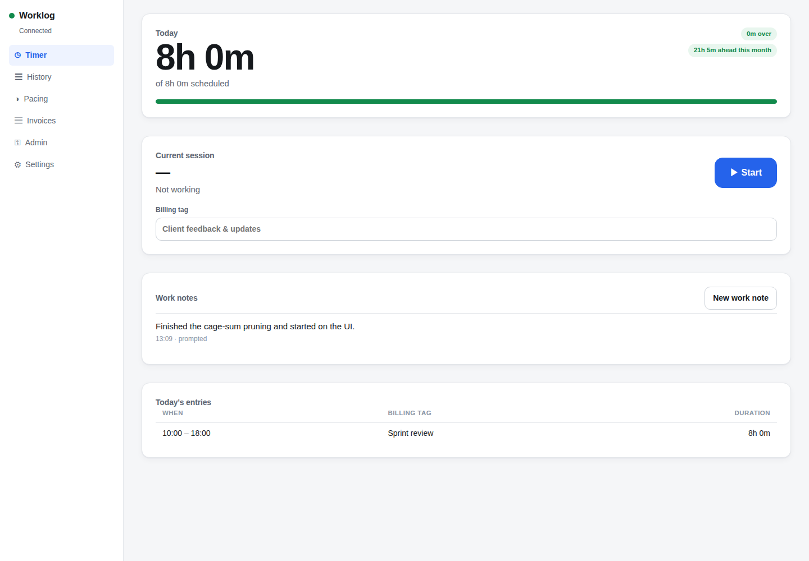
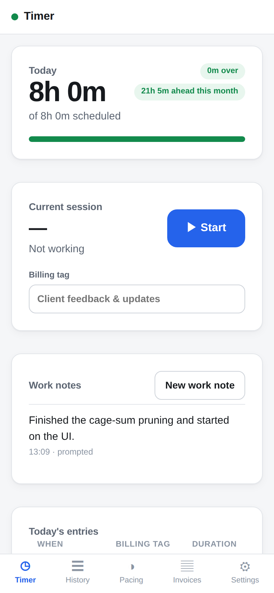
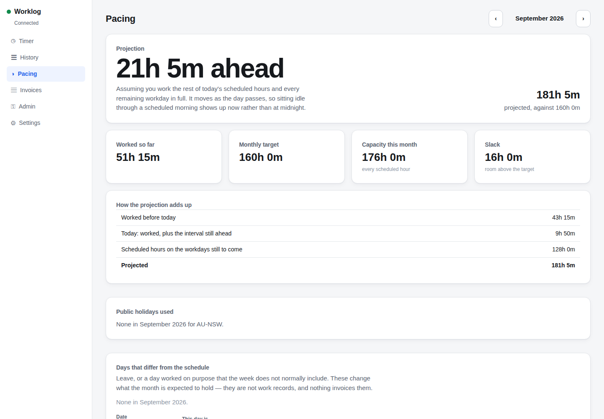
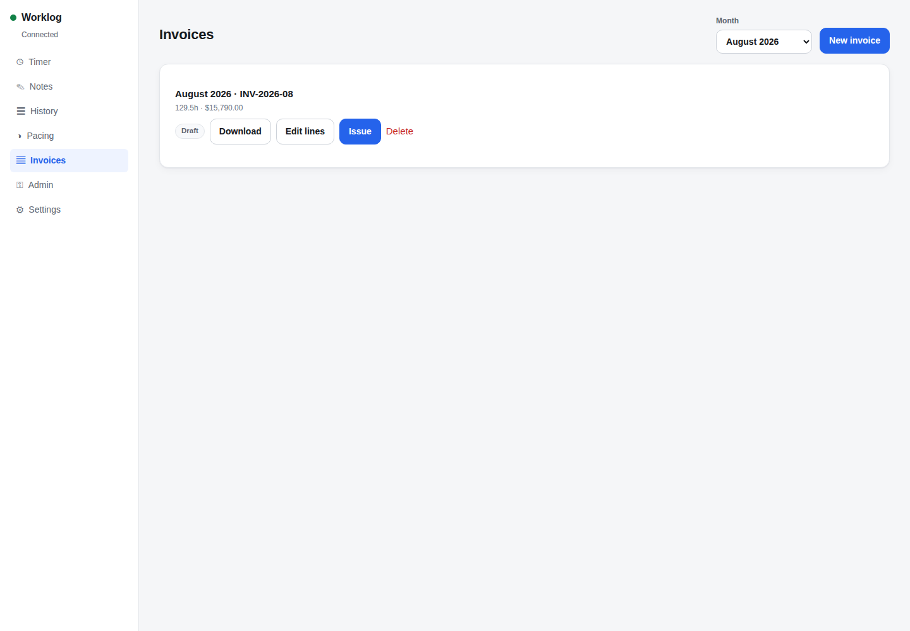

# Worklog

Self-hosted work time tracking and invoicing. A Deno server holds the truth in SQLite; a React
frontend reaches it over [KPS](https://github.com/ethereum/kps) — from a Deno Desktop window or from
a static page on GitHub Pages, both dialling the same `<ip>:<port>:<certhash>` address.




[`REQUIREMENTS.md`](REQUIREMENTS.md) is the specification, and it is **append-only**: items keep
their numbers forever, superseded ones are struck through rather than edited, and new sections are
added rather than folded into old ones. That is what makes a reference to `6.10` safe to write down
and never revisit. Nearly every comment in this codebase cites one.

## Running it

```sh
deno task deps          # npm install, once — see "Why there is a package.json" below
deno task serve         # prints the address a frontend needs
```

```sh
deno task web           # the frontend, on http://127.0.0.1:5273
deno task web:build     # or a static bundle in web/dist
deno task desktop       # or the same frontend in a desktop window
```

The server prints something like `192.168.1.5:41108:uEiA…`. Paste it into the frontend's first
screen. **It is the only way in**, so treat it as a secret until a device is authorized — the first
device to arrive can claim admin, and every one after that has to be approved by an admin.

`deno task seed ./data` fills a database with invented work if you want something to look at.
`deno task shots` rebuilds the frontend and drives a real browser through the whole thing. It needs
`CHROME_PATH` pointing at a Chromium, because Playwright cannot download one everywhere; it checks
before it starts rather than after a minute of setup.

## Layout

| | |
| --- | --- |
| `shared/` | The domain core. Imports no runtime — no filesystem, no socket, no DOM — which is what makes 1.19's "one core behind both frontends" true by construction rather than by discipline. |
| `server/` | SQLite, the stores, the dispatcher. Everything KPS-shaped is in `main.ts` alone. |
| `web/` | React + Vite. Two shells over one set of screens. |
| `tools/` | The seeder, and the two browser harnesses over their shared rig. |

## Some decisions worth knowing about

**A work entry is filed under a plain calendar date, and that date is decided once.** It comes from
the local calendar of the device that *started* the timer, is captured at start rather than at stop,
and nothing later can move it — a session across midnight belongs entirely to the day it began
(2.19–2.23). Everything downstream is then timezone-free: the month an entry belongs to is a
substring of a string.

**Pacing is a schedule, not a number of hours.** Every day of the month contributes work recorded on
it plus however much of its scheduled interval has not yet elapsed. A past day has none left, a
future day has all of it, today has the part after the current minute — so the projection moves
through the day, and sitting idle through a scheduled morning shows up now rather than at midnight.
The pacing screen shows the terms adding up, because a pace figure on its own is a number to be
believed or not.

**A month is the unit of invoicing.** That collapses "do these two invoices overlap?" to a string
comparison, and makes the real rule *at most one issued-or-paid invoice per calendar month* — which
is enforced twice: by `canIssue`, so the caller gets a sentence, and by a partial unique index, so a
race cannot get past. Drafts are invisible to the index, so any number may coexist, and reverting an
issuance frees the month with no code of its own.

**Signing is an interface, not a key.** In a browser tab it is a non-extractable `CryptoKey` kept
in IndexedDB *as a key* rather than as bytes — Ed25519 honours `extractable: false` for the private
half while still letting the public half out, so "never leaves the device" is something the key
cannot do rather than a rule this code follows. In the desktop window it is a file the operating
system protects and the page asks the shell to sign. Either way the client never sees key material,
which a test proves by handing it a signer made of two plain functions.

**Payment details never come back from the server.** They are needed to edit and to render a PDF,
never to display, so the read path deletes them. `SENSITIVE_INVOICE_FIELDS` names them in one place,
and `publicInvoiceConfig` deletes rather than allow-lists — a new field reaches the UI by default,
and a newly-sensitive one leaves the wire by editing one list.

**The two presentations are separate shells, not breakpoints.** A sidebar does not become a tab bar
by getting narrower. What they share is everything below them: the same screens, the same store, the
same client. The viewport picks, not the runtime, so a narrow desktop window gets the phone layout —
the constraint being solved is how much room there is.

## The desktop window

`deno task desktop` runs the same bundle in a `Deno.BrowserWindow`. What it adds is a window that
stays on top (**Settings → This window**) and a device key the operating system protects: the shell
generates it into `device-key.json` at `0600`, re-imports it non-extractable, and the page asks for
signatures rather than holding anything. That is a stronger reading of "the private key never
leaves the device" than a browser can offer, where the key at least lives in the tab's storage.

Getting there turned up four things about `deno desktop` worth writing down, because none of them
fails loudly:

- **An HTTP listener inside the app accepts nothing.** `Deno.serve` calls `onListen` and every
  connection is refused — inside the process and out, main thread and worker. So the bridge is
  `BrowserWindow.bind`, not a loopback fetch.
- **A permission prompt hangs rather than fails**, because a packaged app has no terminal to answer
  it. The build grants `read`, `write` and `env` explicitly — and not `net`, which is what makes
  "the server is never told about window state" a property of the runtime rather than of care.
- **A `file://` page cannot load an ES module by `src`.** `web/inline.mjs` folds the bundle into
  one `desktop.html`; an inline module has nothing to fetch. The Pages build is untouched.
- **A `file://` origin has no dependable storage**, which is why the shell owns the key and the
  device-local settings.

One thing is unverified: **the desktop window reaching a server**. The shell runs, writes its files,
opens the window and loads the app, but this development container's WebKitGTK has no `libnice` and
no `gstwebrtc`, so a WebRTC dial cannot complete in it at all. The same bundle over the same
transport is exercised end to end in Chromium by `deno task shots`.

## Why there is a package.json

Deno cannot install `@kpstreams/server` itself. Its QUIC backend lists
`@infisical/quic-darwin-arm64` as an `optionalDependency` and that package 404s on the registry; npm
skips a failing optional dependency, Deno treats it as fatal. So `deno task deps` runs `npm install`
once and everything after that uses `--node-modules-dir=manual`.

There is a second, related fault worth knowing about: **QUIC streams do not work under Deno.** The
handshake completes and `accept()` resolves, but `acceptStream()` never does, where the identical
client against the identical listener under Node echoes fine. It costs this project nothing, because
both frontends are browsers and take the WebRTC path — which does work, and is exercised end to end
by `deno task shots`.

## Two browser harnesses, and what each is for

`deno task shots` proves every screen renders. `deno task journey` proves pressing things on them
works — nineteen checks across two concurrent browsers: run a timer and watch the other device
learn about it unasked, record time from the phone, edit an entry down to duration-only, delete
one, write a work note and see it arrive, invoice a month, take delivery of the PDF, issue it, and
revoke the phone while it is still holding an open subscription. They share `tools/harness.mjs`
and run on different ports, so both can run at once.

**A device could lose its own identity, and one reload was not enough to see it.** The device key
lives in IndexedDB, and two modules opened that database independently: `deviceKeys.ts` at version
1, `localAudio.ts` at version 2. IndexedDB refuses to open an existing database at a lower version,
so once anything touched the audio store, every later attempt to read the key failed with
`VersionError` — and a device that cannot read its key cannot prove who it is, so it lands back on
the connect screen and needs an admin to approve it all over again. Play the loop file once and
reload, and the phone has forgotten itself. `web/src/idb.ts` now owns the database, its version and
its stores, and a test counts the `indexedDB.open` calls, because nothing in the type system can
see two callers disagreeing about a number.

The distinction earned itself. The screenshots were green for a fortnight while **"Generate PDF"
rendered a document onto the server's disk and handed the person who pressed it nothing** — the
button existed, the screen rendered, the call succeeded, and the result was discarded (8.33). And
underneath that, **every subscription silently dropped its first event**: the subscribe
acknowledgement went out through `encodeJson` with no trailing newline while every event after it
had one, so the two arrived as one unparseable string and the client's `catch` counted it as one
event lost. Nothing failed. The device that made a change refreshed itself and looked right; the
second device was one event behind forever. It took two browsers to see it, and the test that
should have caught it was green because its *fake* transport wrote the newline the real server
did not.

## The screenshots are the end-to-end test

`tools/screenshots.mjs` mocks nothing. It seeds a database, starts the real KPS listener, serves the
real production bundle, and drives Chromium through the real claim-admin handshake over WebRTC —
then opens a *second* browser context, which is genuinely a second device because the key lives in
IndexedDB, has it request access, and approves it from the first. If the transport, the protocol,
the signing or either shell is broken, there are no pictures.




The invoice PDF is rendered on the server and follows the supplied format closely — see
[`docs/invoice-sample.pdf`](docs/invoice-sample.pdf), generated from the fixture by
`deno run -A --node-modules-dir=manual tools/invoice-pdf.ts ./data 2026-08 out.pdf`.
